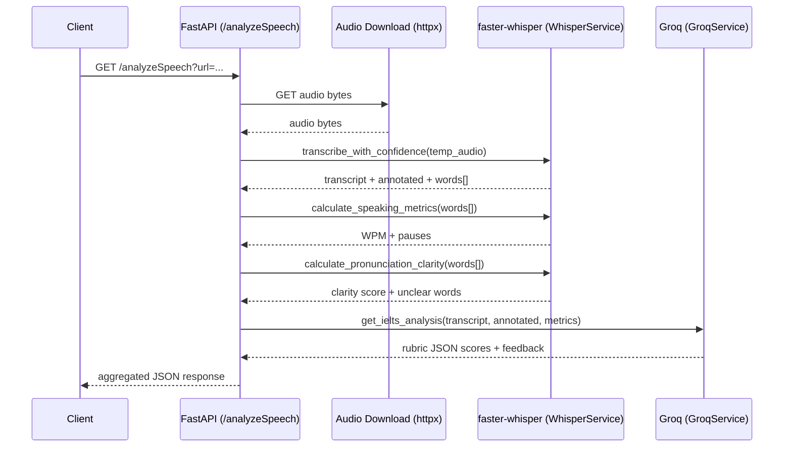

# Simple Listening Demo — Architecture & Improvement Notes

This document reviews the current system architecture and scoring logic in this repo, then proposes concrete improvements (including models/algorithms and evaluation).

## 1) What is happening (current system)

### 1.1 Components (“services” in this repo)

This repo is a single FastAPI application that orchestrates two internal service classes:

- **API service (`main.py`)**
  - Exposes:
    - `GET /` (API info)
    - `GET /health` (readiness flags)
    - `GET /analyzeSpeech?url=...` (main workflow)
- **Transcription + feature service (`services.py:WhisperService`)**
  - Loads a local **faster-whisper** model once at startup: `WhisperModel("small.en", device="cpu", compute_type="int8")`.
  - Downloads audio from a URL to a temp file, transcribes with `word_timestamps=True`, and extracts:
    - word text
    - per-word timestamp (`start`, `end`)
    - per-word confidence (`probability`, rounded to 2 decimals)
  - Computes two derived feature sets from the word timeline:
    - **Speaking metrics**: words-per-minute, duration, and pause categorization.
    - **Pronunciation clarity heuristic**: maps Whisper confidence buckets to an IELTS-like 1–9 score.
- **LLM analysis service (`services.py:GroqService`)**
  - Calls the **Groq** chat completions API (model id currently `llama-3.3-70b-versatile`).
  - Sends the transcript + “annotated transcript” (word(confidence)) + computed speaking metrics.
  - Requests a **strict JSON object** (rubric-shaped) with fluency/coherence, lexical resource, grammar, filler words, and overall scores.

External dependencies:

- **Audio hosting**: the API downloads the user-provided audio URL (default points to an external mp3).
- **Groq LLM API**: used for rubric-based scoring; requires `GROQ_API_KEY`.

### 1.2 End-to-end request flow (`GET /analyzeSpeech`)

At a high level:

1. **Download audio** from the provided `url` into a temporary file.
2. **Transcribe audio** using faster-whisper with word-level timestamps.
3. **Compute speaking metrics** from the timestamps (WPM + pause analysis).
4. **Compute pronunciation clarity** from Whisper word confidence values (heuristic).
5. **Request IELTS analysis** from Groq using the transcript + annotated transcript + speaking metrics.
6. **Aggregate**:
   - LLM rubric outputs (fluency, lexical, grammar, filler words)
   - Whisper-derived features (pauses/speed + pronunciation clarity + low-confidence words)
7. **Return JSON** response.

Sequence diagram:

### 1.3 Current feature/scoring logic (how “evaluation” happens today)

**A) Fluency & coherence**

- Primary scorer: **LLM** (Groq) using transcript content + the derived speaking metrics context.
- Derived metrics used:
  - words per minute
  - “good” pauses (0.3s–1.5s) and “bad” pauses (>1.5s)
  - total pause time and a heuristic feedback string

**B) Lexical resource + grammar**

- Primary scorer: **LLM only**, based on transcript text (plus annotated confidence context).
- Output is rubric-shaped JSON with per-category scores and example “mistakes/errors”.

**C) Pronunciation**

- Current implementation is explicitly partial:
  - `clarity` is computed from Whisper word confidence thresholds (and then mapped to 1–9).
  - intonation/stress and rhythm/chunking are placeholders (“In Development”).

**D) Overall band score**

- Computed as the mean of the available non-zero subscores:
  - fluency/coherence (LLM)
  - lexical (LLM)
  - grammar (LLM)
  - pronunciation (Whisper-confidence clarity)

### 1.4 Notable architectural properties / constraints

- **Model loads at import time**: `transcription_service = WhisperService()` runs when importing `services.py`.
- **CPU-bound transcription in request path**: faster-whisper transcription is compute-heavy and runs inline.
- **Network reliance**: request requires downloading an audio URL; analysis requires Groq API if configured.
- **No ground-truth evaluation loop**: the system produces a score, but there is no offline benchmarking against human IELTS ratings in this repo.

## 2) What can be improved (architecture + models/algorithms + evaluation)

### 2.1 Engineering / system architecture improvements

1. **Secrets hygiene**
   - Do not store API keys in tracked `.env` files.
   - Use environment variables in deployment and commit a `.env.example` instead.
   - Rotate any key that has been committed previously.

2. **Input validation + safety**
   - Validate `url` (scheme allowlist, host allowlist/denylist, prevent SSRF, size limits).
   - Enforce max audio duration / file size; reject unsupported content types early.
   - Add timeouts + bounded retries for downloads.

3. **Performance + concurrency**
   - Run CPU-bound STT work via a worker pattern:
     - simplest: `run_in_threadpool` / background tasks with a bounded queue
     - stronger: separate **transcription worker** (Celery/RQ/Redis) and keep the API responsive
   - Add caching keyed by `(audio_hash, model_id, prompt_version)` to avoid recomputing.

4. **Robustness of outputs**
   - Add JSON schema validation for LLM responses and fall back to partial results (instead of failing the whole request).
   - Return actionable 4xx errors for bad inputs (invalid URL, unsupported format) rather than 500.

5. **Observability**
   - Emit structured logs with per-stage timings:
     - download_ms, transcribe_ms, llm_ms, total_ms
   - Add request IDs and (optionally) distributed tracing for debugging.

### 2.2 Model/algorithm improvements (feature quality)

#### A) Transcription (STT) quality and timestamps

- **Upgrade STT model** for higher accuracy (especially with accents/noise):
  - try larger Whisper variants (or tune decoding parameters like beam size)
  - consider specialized English or accent-robust ASR models
- **Better alignment**
  - incorporate forced alignment / alignment tools to improve word timestamps (and downstream pause metrics)
  - this also improves any “speaking rate” metric stability

#### B) Fluency and coherence (beyond WPM + long pauses)

Add objective fluency features commonly used in spoken language assessment:

- **Articulation rate**: words/syllables per second excluding silent time.
- **Phonation time ratio**: speaking time / total time.
- **Mean length of run**: average words between pauses.
- **Disfluency detection**:
  - repetitions (“I I I…”), repairs, false starts, filled pauses rate per minute
  - self-corrections detection via transcript patterns + timing
- **Pause distribution**:
  - percentile statistics (p50/p90), not just threshold counts
  - pauses at clause boundaries vs mid-phrase (requires light syntactic parsing)

These can become “grounded evidence” features that the LLM references, or can be used in a hybrid scoring model.

#### C) Pronunciation (replace Whisper-confidence heuristic with speech features)

Whisper confidence is affected by many factors that are not purely pronunciation (noise, mic quality, speaking style, OOV words), so it’s a weak proxy.

Consider adding pronunciation/prosody features that directly model speech:

- **Phone-level alignment + GOP (Goodness of Pronunciation)** style scoring
  - use an aligner to estimate phone posteriors and detect likely mispronunciations
- **Prosody**
  - extract F0 (pitch), intensity/energy, speaking rhythm metrics
  - compute stress/intonation features (e.g., pitch range, pitch movement, boundary tones proxies)
- **Intelligibility / quality predictors**
  - use a speech-quality model (MOS/intelligibility) as a separate signal

These signals can feed:

- a learned pronunciation subscore model, and/or
- a constrained LLM rubric prompt that references numeric evidence.

#### D) Lexical resource (objective NLP features + calibrated scoring)

Add transcript-based lexical features:

- **Lexical diversity**: MTLD / HD-D / moving-average TTR.
- **Lexical sophistication**: frequency band coverage, CEFR wordlist features.
- **Collocations**: n-gram or dependency-based collocation patterns.
- **Error-aware features**: discount obvious ASR artifacts (repeated fragments, partial words).

Then:

- either combine these with the LLM rubric output (hybrid),
- or train a small regression/classifier to predict lexical band from these features on labeled data.

#### E) Grammar (spoken grammar signals)

For spoken grammar:

- Add **syntactic complexity** measures (clause density, subordination, dependency depth).
- Add an optional **grammar error correction** pass (GEC) to count correction types and severity.
- Normalize by length (errors per 100 words) and include confidence bounds.

### 2.3 Evaluation improvements (make scoring “better in evaluation”)

Right now, the system produces rubric scores, but there is no measured relationship to human IELTS ratings.

To improve evaluation quality:

1. **Define ground truth**
   - Build/obtain a dataset of speaking samples with **human examiner band scores** (overall + subscores).

2. **Offline evaluation harness**
   - Run the pipeline across the dataset and compute:
     - **MAE/RMSE** to human subscores and overall
     - **Pearson/Spearman correlation** with human scores
     - **Quadratic Weighted Kappa (QWK)** for band agreement
   - Track these metrics per version:
     - STT model version
     - prompt version
     - feature set version

3. **Stability and calibration**
   - Measure run-to-run variance of LLM scores (temperature effects).
   - Prefer lower temperature and/or multi-sample aggregation for stability.
   - Calibrate model outputs to human bands (e.g., isotonic/Platt scaling or constrained regression).

4. **Ablations**
   - Compare:
     - LLM-only (transcript)
     - transcript + speaking metrics
     - transcript + expanded objective features
     - hybrid model (objective features + LLM)
   - Keep a “baseline” pinned so improvements are measurable.

5. **Production monitoring**
   - Monitor drift in:
     - audio duration distribution
     - WPM/pause stats
     - transcript length and confidence distribution
   - Alert on increased error rates/timeouts and on unusual score distributions.

### 2.4 Practical roadmap (suggested)

- **Quick wins (1–2 days)**
  - input validation, better error handling, stage timings, schema validation for LLM responses
  - remove committed secrets; `.env.example`
  - cache by audio hash
- **Medium (1–2 weeks)**
  - richer fluency features; improved pause metrics; stability improvements (multi-sample or temperature control)
  - evaluation harness + small labeled set to quantify correlation
- **Longer term**
  - pronunciation/prosody modeling (alignment + GOP + F0 features)
  - learned hybrid scorer trained and calibrated to human ratings

